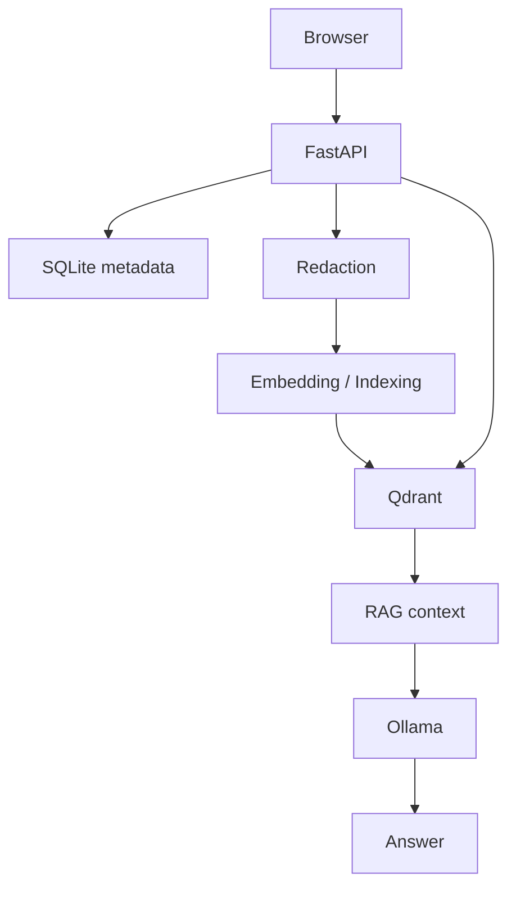

# Architecture

## v0.1



### Boundaries
- The host is not exposed directly to the LLM.
- v0.1 has no shell execution or autonomous actions.
- Future collectors run as a separate host agent with explicit allowlisted paths.

## Evolution

```text
Observe -> Redact -> Understand -> Store -> Retrieve -> Document -> (future) Act with approval
```
